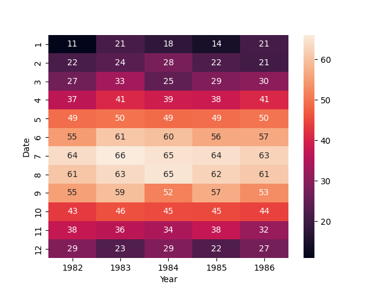
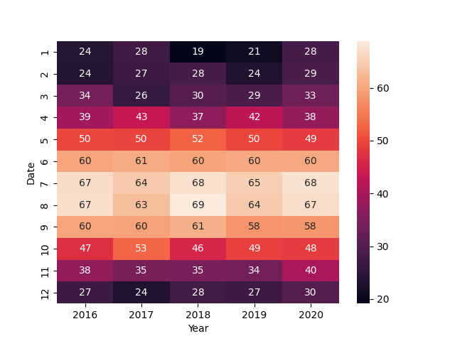

# Weather-comparison
Learning Pandas through a small project that compares weather data. Graphs for monthly average high, monthly lows, and monthly highs will be added.

## Data
The data set I'm using is temperature lows and highs from the Boston area from the last 40ish years and comes from https://prism.oregonstate.edu/.

## Graphs
These graphs show the average low temperature throughout each month in two different year ranges.

